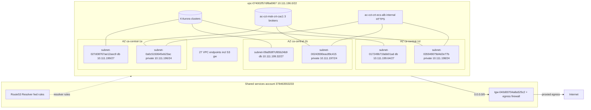
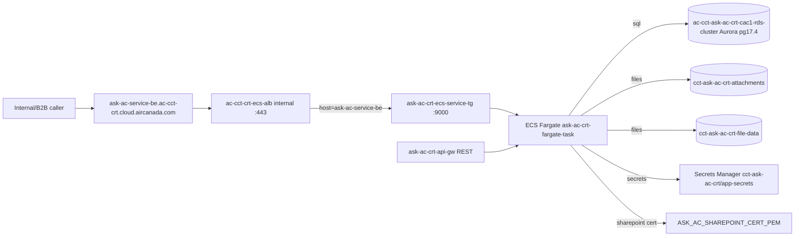
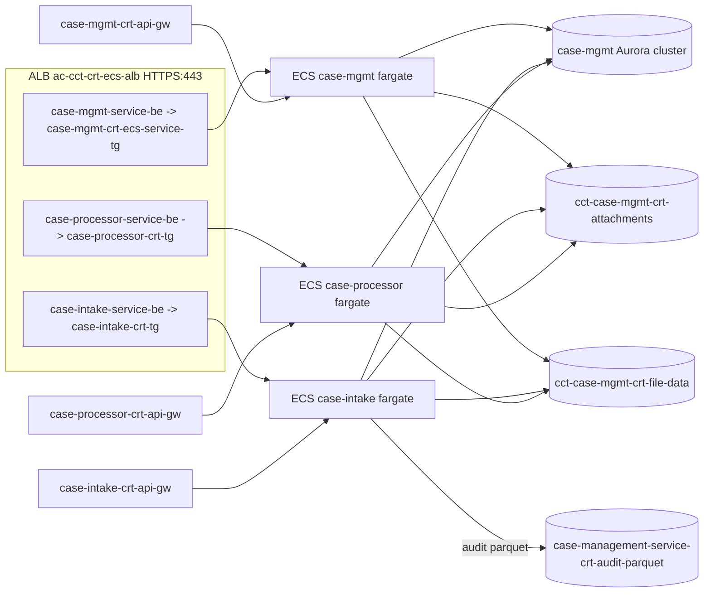
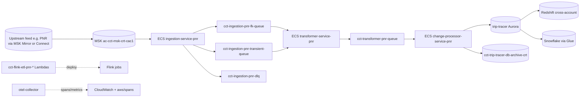
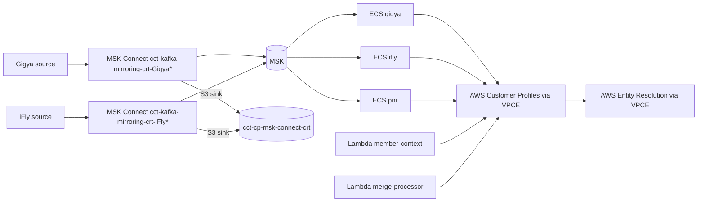
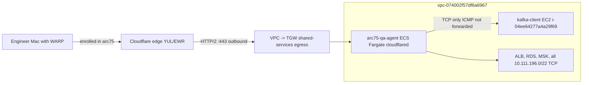

# AC-CCT-CRT (050752605169 / ca-central-1) — Architecture Inventory

Snapshot date: 2026-04-18. Read-only inventory; no resources mutated.

## Executive summary

This is the non-prod ("CRT" = pre-prod) AWS account for **Air Canada's Customer Care Transformation (CCT)** workload. It runs a single VPC (`vpc-074002f57df8a6967`, 10.111.196.0/22) with **no IGW, no NAT GW, no public subnets** — all egress goes through a Transit Gateway (`tgw-040d00704a8a525c2`) owned by the AC shared-services account `378463553233` ("AC-CCT-CRT-sharedservices-cac"). Inbound is similarly TGW-only; the single ALB is `internal`-scheme. DNS forwarding (`.` → on-prem) and the `amazonaws.com` system rule are pushed in via shared-services Route53 Resolver.

The macro shape: **9 production-ish applications** (askac, acpedia, claims-dashboard, case-mgmt, case-intake, case-processor, rule-engine-platform, customer-profile, trip-tracer) plus the CMP/auth/SP API layers and a large stream-processing tier. Compute: **167 Lambda functions, 41 ECS services across 4 Fargate clusters, 2 EC2 instances** (one t2.micro `test-a`, one `kafka-client` SSM jump host), no EKS/Batch/ASG. Data: **4 Aurora PostgreSQL 17.4 clusters (8 instances), 5 DynamoDB tables, 39 S3 buckets, 1 MSK cluster (3 brokers, Kafka 3.8.x), 20 MSK Connect connectors**. Integration: **10 REST APIs, 11 Glue jobs, 7 Glue databases, 82 SQS queues, 11 SNS topics**. No EKS, OpenSearch, ElastiCache, EFS, Neptune, DocDB, MWAA, AppSync, Step Functions, Bedrock, SageMaker, or NLB. The recently-added `arc75-qa-agent` Cloudflare tunnel (cloudflared on Fargate) is the bastion documented in `README.txt`.

Deployment is a **CDK-on-CFN majority** (124 active stacks, mostly `cct-*-crt` or `ac-cct-*-crt` with CDK metadata) layered on a Terraform-managed baseline (TGW attachment, IAM roles, the VPC itself per the `Repository=ac-cct-infra` tag).

## Networking foundation

### VPC and subnets

| VPC | CIDR | Subnets |
|-----|------|---------|
| `vpc-074002f57df8a6967` (AC-CCT-CRT-vpc) | 10.111.196.0/22 | 6 (3 AZ × 2 tiers) |

Subnets (all private — no public subnets exist; `MapPublicIpOnLaunch=false` on all):

| Subnet | CIDR | AZ | Tier | Route table |
|--------|------|----|----|-------------|
| `subnet-0a0c5150645eb23ac` | 10.111.196.0/24 | ca-central-1a | private (apps) | `rtb-03a3a0d0b4a4ed226` |
| `subnet-00243590eac89c415` | 10.111.197.0/24 | ca-central-1b | private (apps) | `rtb-0e49812bab42b451b` |
| `subnet-035949079d4d2e77b` | 10.111.198.0/24 | ca-central-1d | private (apps) | `rtb-0088c2918c2813bbb` |
| `subnet-027d08767ae12aec9` | 10.111.199.0/27 | ca-central-1a | db | `rtb-03a3a0d0b4a4ed226` |
| `subnet-09a958f7cf65b24b9` | 10.111.199.32/27 | ca-central-1b | db | `rtb-0e49812bab42b451b` |
| `subnet-017249b71fabb01ad` | 10.111.199.64/27 | ca-central-1d | db | `rtb-0088c2918c2813bbb` |

The kafka-client EC2 sits in 10.111.198.144 (`subnet-035949079d4d2e77b`). All four route tables are identical otherwise: `local`, `0.0.0.0/0 → tgw-040d00704a8a525c2`, and the S3 prefix-list `pl-7da54014` → S3 gateway endpoint. The fourth RT (`rtb-0c5dba032c1892930`, "AC-CCT-CRT-vpc-default") is `main` association only and has no default route — effectively unused.

### TGW egress posture

- Single TGW attachment `tgw-attach-04cf5daa322554028` to `tgw-040d00704a8a525c2` in account `378463553233` (sharedservices-cac). Associated to TGW route table `tgw-rtb-0de15d611953b680a`.
- **No NAT GW, no IGW, no EIPs** — all internet-bound traffic is hairpinned through the shared-services account's egress (typically AWS Network Firewall + Squid/proxy stack in AC's pattern).
- This is the egress that **blocks UDP/7844 to *.argotunnel.com** — confirmed in `README.txt` notes; QUIC for the Cloudflare tunnel was unusable, hence the HTTP/2 setting on `arc75-qa-agent-cloudflared`.
- DNS: shared-services Route 53 Resolver pushes a `.`-domain FORWARD rule (`sharedservices-cac-dns-resolver-dot-fwd-rule`) plus a SYSTEM rule pinning `amazonaws.com`. No local resolver endpoints in this account.
- No VPN, no Direct Connect, no VPC peering, no Network Firewall in-account — all sit upstream.

### VPC endpoints (27)

Heavy private-only posture, which makes sense given no NAT:

| Service | Type | Notes |
|---|---|---|
| s3 | Gateway + Interface | both, S3 traffic uses gateway PL |
| ssm, ssmmessages, ec2messages | Interface ×3 | SSM Session Manager (used to reach kafka-client) |
| ecs, ecr.api, ecr.dkr | Interface ×3 | Fargate task pulls |
| logs, monitoring, kms, sts, lambda, secretsmanager | Interface ×6 | core control plane |
| pipes-data, execute-api | Interface ×2 | EventBridge Pipes, API GW |
| entityresolution, profile | Interface ×2 | Customer Profile + Entity Resolution services |
| `vpce-svc-0a268b84d32edc322` ×4 | private endpoint service | likely shared-services proxy |
| `vpce-svc-02514fc06cfc4643a` ×4 | private endpoint service | likely shared-services proxy |
| `vpce-svc-05ff51ff575a5189c` ×1 | private endpoint service | likely shared-services proxy |

The duplicated x4 of two private services across the 4 RTs is the multi-AZ deployment of those VPCEs.

### Mermaid: VPC overview

## Per-application architecture

App grouping is inferred from CloudFormation stack prefixes, S3 bucket prefixes, ECS service names, ECR repos, and target-group names. Stack tags consistently carry `Application=CCT`, `Environment=CRT`, `ProjectName=Customer Care Transformation`, `tower=customer`, `Repository=https://github.com/AC-IT-Development/ac-cct-infra` (and adjacent repos).

### 1. ask-ac (Ask AC chatbot back-end)

- **Public name**: `ask-ac-service-be.ac-cct-crt.cloud.aircanada.com` → ALB rule priority 1 → TG `ask-ac-crt-ecs-service-tg` (port 9000, HTTP, IP targets).
- **Compute**: ECS Fargate service `ac-cct-crt-ask-ac-ecs-fargate-service` on cluster `ac-cct-crt-ecs-cluster` (task `ask-ac-crt-fargate-task:1`, currently desired=1 / running=0).
- **API GW**: REST API `ask-ac-crt-api-gw` (id `q45hr1z6tc`).
- **Data**: Aurora PostgreSQL 17.4 cluster `ac-cct-ask-ac-crt-cac1-rds-cluster` (2 r7g.large instances, multi-AZ, encrypted). S3: `cct-ask-ac-crt-attachments`, `cct-ask-ac-crt-file-data`, `cct-ask-ac-crt-logs`, `askac.ac-cct-crt.cloud.aircanada.com` (CloudFront origin or static front-end).
- **Secrets**: `cct-ask-ac-crt/app-secrets`, `ASK_AC_SHAREPOINT_CERT_PEM`, `/crtca1/ac-cct-ask-ac-crt-cac1-cluster/db-credentials`.
- **ECR**: `ask-ac-crt-ecr-repository`.

### 2. acpedia

- **Public name**: `acpedia-service-be.ac-cct-crt.cloud.aircanada.com` → ALB rule priority 2 → TG `acpedia-crt-ecs-service-tg` (port 8000).
- **Compute**: ECS Fargate `ac-cct-crt-acpedia-ecs-fargate-service` (task `acpedia-crt-fargate-task:1`, desired=1 running=0). Note the task is currently routed through the `ask-ac-crt-ecs-service-tg` per `describe-services` (looks like a config slip — see Gaps).
- **API GW**: `acpedia-crt-api-gw` (id `qxb7lvk9xg`).
- **Data**: S3 `cct-acpedia-crt-attachments`, `cct-acpedia-crt-file-data`, `cct-acpedia-crt-logs`, `acpedia.ac-cct-crt.cloud.aircanada.com` (front-end).
- Reuses the shared `ac-cct-rule-engine-crt-cac1-rds-cluster` Aurora? Not confirmed; no dedicated Aurora.

### 3. claims-dashboard

- **Public name**: `claims-dashboard-service-be.ac-cct-crt.cloud.aircanada.com` → TG `claims-dashboard-crt-ecs-svc-tg` (port 8000).
- **Compute**: `ac-cct-crt-claims-dashboard-ecs-fargate-service` (task `claims-dashboard-crt-fargate-task:2`, desired=1 running=0).
- **API GW**: `claims-dashboard-crt-api-gw` (id `ce2xl6jzmi`).
- **S3**: `cct-claims-dashboard-crt-{attachments,file-data,logs}`, `claims-dashboard.ac-cct-crt.cloud.aircanada.com` (front-end).
- **ECR**: `claims-dashboard-crt-ecr-repository`.

### 4. case-mgmt + case-intake + case-processor (all part of "Case Management")

Three Fargate services on `ac-cct-crt-ecs-cluster`, each with its own ALB host-header rule and API GW:

| Service | ALB host | TG | API GW |
|---|---|---|---|
| `ac-cct-crt-case-mgmt-ecs-fargate-service` | `case-mgmt-service-be.ac-cct-crt…` | `case-mgmt-crt-ecs-service-tg:8000` | `case-mgmt-crt-api-gw` (`s2xi4pbtyc`) |
| `ac-cct-crt-case-intake-ecs-fargate-service` | `case-intake-service-be.ac-cct-crt…` | `case-intake-crt-tg:8000` | `case-intake-crt-api-gw` (`f6ou1azcha`) |
| `ac-cct-crt-case-processor-ecs-fargate-service` | `case-processor-service-be.ac-cct-crt…` | `case-processor-crt-tg:8000` | `case-processor-crt-api-gw` (`1lzq44sch7`) |

- **Data**: Aurora `ac-cct-case-mgmt-crt-cac1-rds-cluster` (2 r7g.large). S3 `cct-case-mgmt-crt-{attachments,file-data,logs}`, `case-management-service-crt-audit-parquet`. Secret `crt/lambda/case-management-api-key`, `/crtca1/ac-cct-case-mgmt-crt-cac1-cluster/db-credentials`.
- **ECR**: `case-mgmt-crt-ecr-repository`, `case-intake-crt-ecr-repository`, `case-processor-crt-ecr-repository`.
- Of the three only `case-intake` is currently running (1/1); the other two are 0/1.

### 5. rule-engine-platform (REP)

- **ALB host**: `rule-engine-platform-service-be…` → `rep-crt-ecs-tg:8000`.
- **Compute**: `rule-engine-platform-crt-service` (task `rule-engine-platform-crt-fargate-task:25` — heavy iteration, currently 1/1 running). No LB attachment field on the service describe (so probably wired by host-header to the TG above, but not via the standard ECS LB integration — worth verifying).
- **API GW**: `rule-engine-platform-crt-api-gw` (id `10c6lig13e`).
- **Data**: Aurora `ac-cct-rule-engine-crt-cac1-rds-cluster` (2 r7g.large). Secret `/crtca1/ac-cct-rule-engine-crt-cac1-cluster/db-credentials`.
- **ECR**: `rule-engine-platform-crt-ecr-repository`, `ac-cct-rule-engine-ecr`.

### 6. customer-profile (Gigya / iFly / PNR / Member-context / Merge-processor)

- **Cluster**: dedicated `cct-customer-profile-cluster-crt` (3 ECS Fargate services, all 1/1 running).
  - `cct-customer-profile-gigya-crt` (task rev 3)
  - `cct-customer-profile-ifly-crt` (task rev 3)
  - `cct-customer-profile-pnr-crt` (task rev 11 — most-iterated)
- **Lambdas**: `cct-customer-profile-member-context-crt` (lambda execution role), plus CDK-deployed merge processor framework helpers.
- **MSK Connect**: `cct-kafka-mirroring-crt-{Gigya,iFly}FeedMskConnect{,S3}-connector-*` — bring Gigya & iFly feeds onto MSK and into S3.
- **Stacks**: `cct-customer-profile-infrastructure-crt`, `cct-customer-profile-merge-processor-crt`, `cct-customer-profile-member-context-crt`.
- **DLQs**: `cct-customer-profile-{claims,gigya,ifly,membercontext,pnr,tt-event}-dlq-crt`.
- **S3**: `cct-customer-profile-input-crt`, `cct-cp-msk-connect-crt`.
- **Service endpoint integration**: VPC endpoint to AWS Customer Profiles service (`com.amazonaws.ca-central-1.profile`) and Entity Resolution (`com.amazonaws.ca-central-1.entityresolution`) — these are AWS managed services CP integrates with.
- **KMS**: `alias/customer-profiles-ac-cct-crt`.

### 7. entity-resolution

- **Stack**: `cct-entity-resolution-crt` (CDK).
- **Storage**: S3 `cct-entity-resolution-input-crt`, `cct-entity-resolution-output-crt`.
- **DDB**: `cct-er-cache-crt`.
- **Glue DB**: `cct-entity-resolution-db-crt`.
- **VPC endpoint**: `com.amazonaws.ca-central-1.entityresolution`.
- No ECS/Lambda services owned directly; this app is consumed by customer-profile / trip-tracer.

### 8. trip-tracer

By far the most complex app. Dedicated cluster `cct-trip-tracer-cluster-crt` with **30 Fargate services** following an `ingestion → transformer → processor → updater` pipeline pattern, per-feed:

- Feeds: `aacc, cm, cm-bag, fdm, icoupon, pnr, pnr-tkt-corr, smart-suite, stormx, tkt, customer-profile-cpid, historical-icoupon-redemption`.
- Per feed, typically: `ingestion-service-{feed}` + `transformer-service-{feed}` (consuming SQS pairs `cct-ingestion-{feed}-{fk-queue,transient-queue,dlq}` and `cct-transformer-{feed}-{queue,dlq}`).
- Plus cluster-wide: `cct-trip-tracer-otel-collector-crt`, `event-detection-updater`, `disruption-detection-updater`, `change-processor-{pnr,fdm}`, `processor-coupon-status-update`, `processor-live-icoupon-redemption-ingestion`, `processor-db-archival`.
- **ECR**: 26 repos `cct-trip-tracer-{ingestion,transformer,processor}-{feed}-crt`.
- **Data**: Aurora `ac-cct-trip-tracer-rds-cluster-crt-cac1` (2 r7g.large). S3 `cct-trip-tracer-db-archive-crt`. Redshift secret `ac-cct-trip-tracer-redshift-crt-credentials` (Redshift cluster itself was not visible — likely cross-account or removed).
- **Service Discovery**: Private Route53 zone `cct-trip-tracer.local.` (3 records).
- **Stacks**: `cct-trip-tracer-infra-crt`, `cct-trip-tracer-dashboard-crt`. Per-feed Flink stacks (`cct-flink-{feed}-crt`) and ETL Flink stacks (`cct-flink-etl-{feed}-crt`) supply Lambda-managed deployment of MSK-Flink jobs.
- **Snowflake**: `/crt-cac1/ac-cct-trip-tracer-historical-data-glue-crt-cac1/snowflake-credentials` — exfil to Snowflake via `cct-snowflake-glue-test-job-crt`.
- **ALB**: none — internal-only ECS-to-ECS via Cloud Map (`.local`).

### 9. CMP (Customer Messaging Platform / chatbot)

- **API GW**: `ac-cct-cmp-api-gateway-crt` (id `jz18i65199`).
- **Lambdas (5)**: `ac-cct-cmp-{start-chat,enable-streaming,ai-agent,message-metadata-enrich,message-processor}-crt`.
- **DDB**: `ac-cct-cmp-bot-tokens-crt`, `ac-cct-cmp-rate-limits-crt`, `ac-cct-cmp-session-auth-crt`.
- **SQS**: `ac-cct-cmp-raw-message-{queue,dlq}-crt`. **SNS**: `ac-cct-cmp-message-interceptor-crt`.
- **S3**: `ac-cct-aco-chat-crt`, `ac-cct-aco-chat-crt-cloudfront-logs`, `ac-cct-cmp-message-logs-bucket-crt`.
- **Stacks**: `ac-cct-cmp-api-crt`, `ac-cct-cmp-infra-crt`, `ac-cct-cmp-lambdas-crt`.

### 10. SP — Service Proxy / API platform (`cct-sp-*`)

- **API GW**: `cct-sp-api-crt` (id `lph92mkuvb`) — the central JWT-fronted public API.
- **Lambdas (~25 across stepUp / baggage / flightStatus / getTrip / dashboard / case / customer / notifications / bookingChange / validateToken)**: e.g. `cct-sp-getTrip-crt-get-trip`, `cct-sp-stepUp-crt-{send,verify,resend}-otp`, `cct-sp-flightStatus-crt-by-FIN`, `cct-sp-baggage-crt-by-{pnr,id}`.
- **DDB**: `cct-sp-infra-crt-SessionJwtTableF35A45F5-1XC6KTR28CIP2` (CDK-named JWT session table).
- **Stacks**: `cct-sp-{infra,api,baggage,bookingChange,case,customer,dashboard,flightStatus,getTrip,notifications,stepUp,validateToken}-crt`.

### 11. cct-auth-service

- **Stack**: `cct-auth-service-crt`.
- **API GW**: `cct-auth-service-crt` (id `8c3pk9iuy0`) — has 0.83 GB API GW exec logs (the biggest API GW logs in account, indicates heavy use).
- **Lambdas**: `cct-auth-service-crt`, `cct-auth-service-crt-MachineAuth*` (custom secret-rotation framework).
- **Secrets**: `/cct/auth-service/crt/machine-clients/chatbot-service`, `/cct/auth-service/crt/machine-auth/private-key`.

### 12. arc75-qa-agent (Cloudflare bastion — NEW; documented in `README.txt`)

- **Cluster + service**: `arc75-qa-agent` / `arc75-qa-agent-cloudflared` (1/1 task rev 3).
- **Image**: `cloudflare/cloudflared:latest`, `TUNNEL_TRANSPORT_PROTOCOL=http2` (because TGW egress blocks UDP 7844).
- **Secret**: `arc75/cloudflared/tunnel-token`. **Log group**: `/ecs/arc75-qa-agent` (14d).
- **SG**: `sg-0d8fdad116f178dbe` (egress-only).
- Reuses shared `ac-cct-crt-ecs-task-execution-role` (org SCP `p-w8p5eioi` blocks `iam:CreateRole`).
- **Tunnel**: id `5cca63d6-be91-4636-b270-ed67cfa7a853`, advertises 10.111.196.0/22 to Cloudflare WARP team `arc75`.
- **Purpose**: gives the team WARP-based bastion access to the entire VPC's private CIDR; replaces VPN/SSM-only access for ad-hoc TCP connectivity.

### Per-app diagrams (top apps)

#### askac flow

#### case-management trio

#### trip-tracer feed pipeline (one feed)

#### customer-profile fan-in

#### arc75-qa-agent (cloudflared bastion)

## Shared infrastructure

### MSK (`ac-cct-msk-crt-cac1`)

- **3 brokers, kafka.m5.large, Kafka 3.8.x, PROVISIONED type, ACTIVE.**
- Subnets: 196/24, 197/24, 198/24 (one per AZ).
- Encryption at rest: customer-managed KMS `alias/ac-cct-msk-kms-key-crt-cac1`.
- Encryption in transit: `TLS_PLAINTEXT` client→broker (i.e. listeners in both modes — note plaintext is open), `InCluster=true`.
- **AuthN: SASL/SCRAM enabled, IAM enabled, AND `Unauthenticated` enabled** — anyone in 10.111.196.0/22 with the right SG can talk plaintext+anon. SG `cct-trip-tracer-infra-crt-FargateServiceSGDABE5946-*` allows ingress on 9096/443 from `0.0.0.0/0` (only reachable from inside the VPC since no IGW, but still loose).
- Connect plane: 20 MSK Connect connectors, all RUNNING (10 logical feeds × {kafka, S3-sink} pairs):
  - From `cct-shared-infra-crt`: AACC, BaggageSmartSuite, CM, FDM, ICoupon, PNR, StormX, TKT.
  - From `cct-kafka-mirroring-crt`: Gigya, iFly.

### Route 53 zones

- Public: `ac-cct-crt.cloud.aircanada.com` (45 records — all the `*-be` host-header endpoints), `ac-cct-crt.cloud.aircanada.ca` (4 records).
- Private: `cct-trip-tracer.local.` (3 records — Cloud Map service discovery for trip-tracer ECS-to-ECS).

### KMS customer-managed keys (5)

| Alias | Use |
|---|---|
| `alias/ac-cct-msk-kms-key-crt-cac1` | MSK at-rest encryption |
| `alias/customer-profiles-ac-cct-crt` | AWS Customer Profiles encryption |
| `alias/DefenderForCloudKey` | Microsoft Defender for Cloud (control-plane CSPM) |
| `alias/DefenderForDatabases` | Defender for Databases |
| `alias/kms-memberbackup-prod` | AWS Backup cross-account/region copies |

(All other KMS aliases are AWS-managed defaults.)

### Secrets Manager (18 secrets — names only)

- DB creds: `/crt-cac1/ac-cct-trip-tracer-rds-cluster-crt-cac1/db-credentials`, `/crtca1/ac-cct-{ask-ac,case-mgmt,rule-engine}-crt-cac1-cluster/db-credentials`.
- MSK: `AmazonMSK_ac-cct-msk-crt-cac1`, `/crt/emh/msk-cluster-details`, `ac-cct-notifications-kafka`.
- Lambda: `crt/lambda/{authorizer,flight-status,baggage-tracker,case-management-api-key}`.
- App: `cct-ask-ac-crt/app-secrets`, `ASK_AC_SHAREPOINT_CERT_PEM`.
- Auth: `/cct/auth-service/crt/machine-clients/chatbot-service`, `/cct/auth-service/crt/machine-auth/private-key`.
- Snowflake/Redshift: `/crt-cac1/ac-cct-trip-tracer-historical-data-glue-crt-cac1/snowflake-credentials`, `ac-cct-trip-tracer-redshift-crt-credentials`.
- Bastion: `arc75/cloudflared/tunnel-token`.

### SSM Parameter Store (20 params)

- `/crt-cac1/msk/*` (9) — MSK cluster bootstrap/topic config.
- `/cct/crt/*` (5), `/cct/glue/*` (3), `/crt/layer/*` (1), `/cdk-bootstrap/crt-cac1` (1), `/crt/cac1/*` (1).
- All values left unread per scope.

### Shared IAM (312 roles total)

Role naming reflects the app prefixes. Cross-cutting/shared roles to know about:

- **`ac-cct-crt-ecs-task-execution-role`** — the catch-all task execution role (already shared per `README.txt`); has `AmazonECSTaskExecutionRolePolicy` + `SecretsManagerReadWrite`. Reused by arc75-qa-agent.
- **`ac-cct-crt-back-end-github-oidc-role`** — OIDC trust for GitHub Actions deploys (`ac-cct-infra` repo + friends).
- `cct-trip-tracer-task-execution-role-crt`, `cct-customer-profile-task-execution-role-crt` — per-app exec roles where deeper isolation was wanted.
- `ac-sre-enterprisetools-cross-acount-crt-role` — cross-account access for AC SRE tooling (note typo "acount").
- `backup-events-cross-account-prod`, `role-backup-crossregioncopy-{eventbridge,lambda}-prod` — AWS Backup cross-region copy from the Control Tower baseline.
- ControlTower: `AWSControlTowerExecution`, `aws-controltower-{Administrator,ReadOnly}ExecutionRole`, `AWSLZAtlantisAdminExecutionRole`.
- 3rd-party CSPM: `DefenderForCloud-OidcCiem`, Cyera, Orca (via stack sets).
- App role count by prefix: `cct-flink-*`=96, `cct-sp-*`=29, `cct-customer-*`=7, `cct-trip-*`=3 (most of trip-tracer's IAM is inlined into 96 flink roles).

## Deployment

| Pattern | Indicator | Count |
|---|---|---|
| Terraform-managed | `tag:ManagedBy=Terraform` (e.g. on TGW attachment), repo `ac-cct-msk-infra-tf`, `baseline/non-prod/AC-CCT-CRT` | VPC, TGW attach, IAM baseline, MSK provisioning |
| AWS CDK on CloudFormation | bucket `cdk-crt-cac1-assets-050752605169`, ECR `cdk-crt-cac1-container-assets-050752605169`, stack `ac-cct-crt-cac1-cdktoolkit`, SSM `/cdk-bootstrap/crt-cac1`, lambdas named `*-CustomCDKBucketDeployment*`, `*-LogRetentionaae0aa3c5b4d*`, `*-CustomS3AutoDeleteObject*` | majority — 124 active CFN stacks, ~all `cct-*-crt` and `ac-cct-*-crt` apps are CDK |
| Plain CloudFormation (Control Tower / StackSets) | Stack names beginning `StackSet-…` | 18 baseline/governance stacks |
| AWS SAM | none observed |
| CodePipeline / CodeBuild / CodeDeploy | empty | 0 — deploys are external (GitHub Actions via OIDC role, Terraform Cloud presumably) |

CFN status snapshot:
- 79 active stacks (`UPDATE_COMPLETE`=42, `CREATE_COMPLETE`=37).
- 55 historical `DELETE_COMPLETE` stacks — heavy iteration on `cct-database-management-crt`, `cct-sp-*`, `cct-customer-profile-member-context-crt`, `cct-flink-etl-pnr-crt` over the last few weeks (most recent delete `cct-database-management-crt` 2026-04-16). These are normal CDK redeploy churn.

## Cross-cutting concerns

### Observability

- **Log groups**: 268. Retention distribution: 1 day (34) / 3 day (44) / 7 day (32) / 14 day (62) / 30 day (52) / 731 day (4) / **never expire (40)** — the never-expire ones are mostly Lambda-defaults that nobody set explicit retention on; cost risk over time.
- Top log volume: `/aws/vpc-flow-log/vpc-074002f57df8a6967` (24 GB), trip-tracer transformer task (14 GB), `aws/spans` (12 GB — X-Ray/OTel), customer-profile pnr task (5 GB), `RDSOSMetrics` (5 GB).
- **CW Alarms**: 326 total — 301 OK, 15 ALARM, 10 INSUFFICIENT_DATA. The ALARM count is non-trivial; worth a follow-up.
- **X-Ray**: encryption config `ACTIVE/NONE` (default). Trip-tracer otel-collector ECS task feeds into `aws/spans` (12 GB).
- **Application Signals**: `/aws/application-signals/data` (1.5 GB) — enabled.
- **Managed Grafana / Prometheus**: not enabled in ca-central-1 (Grafana endpoint not regional, AMP empty).
- **GuardDuty**: 1 detector enabled (`76cac85c27af443fb2c9b79c787d1f7e`).
- **Inspector**: DISABLED for ec2/ecr/lambda/lambdaCode (org-managed; can't read org config).
- **Macie**: not enabled.
- **VPC Flow Logs**: enabled (24 GB log group is the proof).

### Secrets & encryption

- All RDS clusters encrypted (`StorageEncrypted=true`), all Aurora clusters multi-AZ.
- MSK at-rest encryption with CMK; in-transit `TLS_PLAINTEXT` (both modes) — see Gaps.
- 5 customer-managed KMS keys; everything else uses AWS-managed defaults.
- Secrets Manager + SSM for app secrets — no hard-coded creds visible in stack outputs (didn't fetch values).
- ACM: 16+ public certs all `ISSUED` for the `ac-cct-crt.cloud.aircanada.com` family, expiring 2026-09-08 (most) and 2027-01-31 (sp); the 09-08 batch is **5 months out** — renewal calendar.

### Data classification per tags

Stacks and the TGW attachment are uniformly tagged `Sensitivity=High`, `Criticality=High`, `RTO=1h`, `RPO=1h`, `BusinessOwner=Derek Whitworth`, `TechOwner=Toula Voulgaris` / `Julie Laurin`. CostCode 1905 / dept `cust-digital`.

## Gaps and observations

### Operational

1. **Most app ECS services in the main cluster are scaled to 0/1.** acpedia, ask-ac, claims-dashboard, case-mgmt, case-processor all show `desiredCount=1, runningCount=0`. Only case-intake (1/1) and rule-engine-platform (1/1) are actually running on the main cluster. ALB target health check returned empty for `ask-ac-crt-ecs-service-tg`. This may be intentional for a non-prod that's stood down, but worth confirming.
2. **acpedia is wired to the wrong target group.** `ac-cct-crt-acpedia-ecs-fargate-service` lists `loadBalancers[0].targetGroupArn = ask-ac-crt-ecs-service-tg` (port 8000) — but the ALB rule for `acpedia-service-be…` points at `acpedia-crt-ecs-service-tg`. Looks like a copy-paste leftover in the stack; benign while the service is at 0 tasks but would mis-register on scale-up.
3. **rule-engine-platform-crt-service** has no `loadBalancers` field on the service — it's the only target of `rep-crt-ecs-tg` per ALB rules but isn't ECS-managed-LB-attached. Either tasks are registering targets manually or the SG-based reachability is going through some side path. Worth verifying.
4. **EC2 `test-a` (`i-0d3ada26f830a5491`, t2.micro)** — looks like an unattributed test instance running since whenever; no `Application` tag. Candidate for cleanup.
5. **Stray DELETE_COMPLETE iteration** — `cct-database-management-crt` was deleted twice in 2 hours on 2026-04-16, suggesting an in-flight migration or troubleshooting; check if the active `cct-database-management-crt` (CREATE_COMPLETE) is the intended state.
6. **40 log groups have no retention set (never expire)** — cost creep.
7. **Stale "10.0.1.0/24" tunnel route** noted in `README.txt` is harmless but doesn't belong to this VPC.

### Security

8. **MSK accepts unauthenticated + plaintext clients** — `Unauthenticated.Enabled=true` and `ClientBroker=TLS_PLAINTEXT`. Any pod/task in the VPC can talk to a broker on port 9092 with no creds. Combined with the loose SG rules below, defence-in-depth is weak. Recommend: disable `Unauthenticated`, switch ClientBroker to `TLS` only.
9. **Two SGs (customer-profile + trip-tracer Fargate service SGs) ingress 9096/TCP and 443/TCP from `0.0.0.0/0`** (`sg-0aebcc400e1158ae5`, `sg-038325e02cba92cbb`, `sg-0163c1b7d011cd66b`, etc.). Because no IGW exists, these can't be reached from the public internet — but with the new arc75 cloudflared tunnel, "anyone in 10.111.196.0/22" effectively includes anyone enrolled in WARP team `arc75`. Tighten to MSK SG references.
10. **`ac-cct-crt-ecs-task-execution-role` over-permissioned** — has `SecretsManagerReadWrite` blanket (per `README.txt`), and is reused by arc75-qa-agent. Means the cloudflared task can read all secrets. SCP blocks creating a tighter role; the workaround is a managed-policy attached only to the task role (not the exec role) and a tight inline policy on the cloudflared task — not done today.
11. **Inspector disabled** for EC2/ECR/Lambda — gaps in CVE coverage on the 48 ECR repos and 167 Lambdas.

### Resource hygiene

12. **No unattached ENIs, no unattached EIPs, no orphaned NAT GWs** — clean from that angle.
13. **Lambda runtimes**: 1 still on `nodejs16.x` (deprecated by AWS — to be sunset; find with `cat /tmp/inv/lambdas.json | python3 -c "..."` if needed). Most on `nodejs22.x`/`python3.11`; modern.
14. **Customer Profile + Entity Resolution use AWS-managed services** with private VPC endpoints (`profile`, `entityresolution`) — good private posture, no public traversal.
15. **Aurora "MultiAZ" reports True at the cluster level but per-instance MultiAZ is False** — that's normal for Aurora (cluster-level multi-AZ via reader in different AZ); not a finding.
16. **Bedrock not used** in this region/account — if AI agents are running (cct-cmp `ai-agent`, ask-ac LLM use), they're calling Bedrock cross-region or via 3rd-party endpoint.

